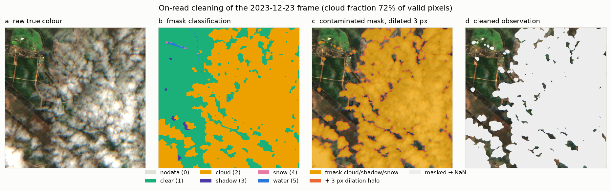

# pysentinel2

A **local Sentinel-2 datacube that fills itself on demand**. Every pixel
this machine ever downloads lands in one sparse, chunk-indexed store —
so nothing is ever downloaded twice: overlapping areas, extended date
ranges and repeat runs all reuse the same chunks. Part of the
[Borevitz Lab](https://borevitzlab.anu.edu.au/) ecosystem; the default
source is [Digital Earth Australia](https://explorer.dea.ga.gov.au/)'s
ARD collections (`ga_s2am_ard_3` / `ga_s2bm_ard_3`) via STAC.

**Full documentation — architecture, grid math, storage, cleaning
science, indices, robustness — lives in [`docs/`](docs/README.md),**
with flowcharts and figures generated from a real store.


## How it works

```
{data_root}/sentinel2_cube/
├── index.db      # SQLite: populated chunks · seen scenes · past searches
└── cube.zarr/
    ├── 2024-01-03/   # one group per solar day
    │   ├── nbart_red # arrays on a fixed EPSG:6933 10 m global grid
    │   └── ...       # sparse: only written 256×256-px chunks exist on disk
    └── 2024-01-08/ ...
```

- Any bbox maps deterministically to a set of ~2.56 km grid chunks.
  `Cube.get_ds(bbox, start, end)` diffs the requested (day × chunk) cells against the
  index and downloads **only the missing cells**.
- STAC results are cached (full item JSON) in the index, so re-reads and
  re-fills of known regions work without re-searching. Cloud-cover
  filtering happens at read time from the index — relaxing the threshold
  later needs no re-search.
- Only raw bands (incl. fmask) are stored. `get_ds(..., clean=True)` applies
  cloud masking **on read** — there is no second "clean" copy on disk,
  roughly halving storage versus a raw+clean layout. See
  [Cleaning & masking](#cleaning--masking) for exactly what the mask does.
- Spectral indices — NDVI, CFI, NIRv, NDTI, CAI — are on-read
  derivatives too: `get_ds(..., indices=('NDVI', 'NIRv'))` computes them
  from cloud-masked reflectance and stores nothing.
- Writes are whole-chunk and the index is transactional (SQLite/WAL): a
  crash mid-fill just leaves cells unmarked, and the next run resumes.

## Usage

The core API is **query-agnostic** — just a bbox and dates, no setup:

```python
from datetime import date
from pysentinel2.cube import Cube

cube = Cube()
bbox = [148.36265, -33.52606, 148.38265, -33.50606]  # [W, S, E, N]

ds_raw = cube.get_ds(bbox, date(2024, 1, 1), date(2024, 12, 31))
ds     = cube.get_ds(bbox, date(2024, 1, 1), date(2024, 12, 31), clean=True)
ds     = cube.get_ds(bbox, date(2024, 1, 1), date(2024, 12, 31),
                     indices=('NDVI', 'CFI', 'NIRv', 'NDTI', 'CAI'))

cube.fill(bbox, date(2024, 1, 1), date(2024, 12, 31))  # → 0: already local
```

Pipelines that speak the shared `borevitz_lab.query.Query` (the
reproducibility layer — stubs, registry) use the adapters:

```python
ds = cube.get_ds_query(query)            # = cube.get_ds(query.bbox, query.start, query.end)
```

`download_sentinel2(query)` and `clean_sentinel2(query)` remain as thin
wrappers over `Cube.get_ds_query` for pipeline compatibility.

Package design (shared across the lab's packages — no inheritance,
composition only):

- **`Query`** (from `borevitz-lab`) — identity: what region, what dates.
- **`Sentinel2`** (`pysentinel2.sentinel2`) — config: STAC URL,
  collections, bands, CRS, cloud threshold, fmask codes.
- **`Paths`** (`pysentinel2.paths`) — derived locations of the store for
  a given `Config`.
- **`grid`** — the fixed global grid (pure, offline-testable math).
- **`Index`** (`pysentinel2.index`) — the SQLite ledger.
- **`Cube`** (`pysentinel2.cube`) — ties them together.

## Cleaning & masking

`clean=True` (and any `indices=` request, which implies it) runs the
window through `pysentinel2.cube.clean_dataset`. The design principle:
**invalid and contaminated are different things.**

| Pixel state | fmask | Meaning | Treatment |
|---|---|---|---|
| Invalid | 0 (nodata) | Outside the scene footprint / never sensed | → NaN; counts *against coverage*, not against cloudiness |
| Clear | 1 | Usable land observation | kept |
| Cloud | 2 | Contaminated | → NaN (dilated) |
| Shadow | 3 | Contaminated | → NaN (dilated) |
| Snow | 4 | Corrupts reflectance stats like cloud | → NaN by default (`mask_snow=False` to keep) |
| Water | 5 | Legitimate signal (NDWI, dams, rivers) | kept by default (`mask_water=True` to drop) |



**Pipeline, in order:**

1. **Classify** every pixel from the fmask band (table above). Band
   nodata values (−999) are additionally masked to NaN.
2. **Dilate** the contaminated mask by `buffer_px` (default 3 px ≈ 30 m,
   circular structuring element). fmask draws tight cloud boundaries;
   the bright halo and penumbra just outside them are the classic
   source of corrupted "clear" pixels.
3. **Gate frames** on two independent, interpretable statistics:
   - `cloud_fraction` = contaminated ÷ **valid** pixels. Frames above
     `max_cloud_fraction` (default 0.5) are dropped. Because the
     denominator is valid pixels, a cloud-free frame that only
     partially overlaps the AOI is *not* penalised for its swath
     margin.
   - `valid_fraction` = valid ÷ all window pixels. Frames below
     `min_valid_fraction` (default 0.2) are dropped — a sliver of
     swath is not a usable observation, however clear.
4. **Annotate**: both statistics attach to the result as `time`
   coordinates, and the filter settings
   (`max_cloud_fraction`, `min_valid_fraction`, `cloud_buffer_px`,
   `masked_fmask_classes`) as dataset attrs — every frame's survival
   is auditable after the fact.

```python
ds = cube.get_ds(bbox, start, end, clean=True,
                 max_cloud_fraction=0.3,   # stricter: ≤30% contamination
                 min_valid_fraction=0.5,   # ≥half the window sensed
                 mask_water=True,          # e.g. for pure-vegetation stats
                 buffer_px=5)              # wider halo exclusion

ds.cloud_fraction    # (time,) — why each surviving frame survived
ds.valid_fraction    # (time,)
```

Nothing here is persisted: different thresholds on the same window are
just different reads of the same raw store.

## Performance

Live measurements against DEA — a ~2 × 2 km AOI, 11-band ARD at 10 m
(one *cell* = one 256 × 256-px chunk on one solar day):

| Scenario | Downloaded | Time |
|---|---|---|
| Cold fill — 3 weeks (3 clear scenes) | 12 cells | 5.7 s |
| Same request again | nothing | **0.0 s** |
| AOI shifted 1 km (inside cached chunks) | nothing | **0.0 s** |
| Date range extended +1 month | 32 cells — *new days only* | 17.2 s |
| Read cached window (512² px × 3 days × 11 bands) | — | 0.13 s |
| Read cached window, cloud-masked (`clean=True`) | — | 0.23 s |

Store footprint: **13.6 MB for 11 solar days** — raw + fmask only, since
the clean cube is a 0.1 s on-read transform rather than a second copy.

Absolute times vary with network and DEA load; the zeros are the point —
they are index lookups, no network involved.

## Install

### Conda (recommended)

```bash
conda install -c conda-forge -c thestochasticman pysentinel2
```

### From source

All lab repos share one conda environment, `borevitz_lab` — each repo's
`environment.yml` creates it if missing and adds its own packages if it
exists (never use `--prune`):

```bash
conda env update -n borevitz_lab -f environment.yml
conda activate borevitz_lab
pip install -e ../borevitz_lab   # shared core (not yet on PyPI)
pip install -e .
```

Without conda, you need the geospatial native stack (GDAL/PROJ)
available system-wide for `rasterio`/`rioxarray`, then the same two
`pip install -e` lines.

## Robustness notes

Hardening for DEA's public S3 + STAC quirks is built in (see
`diagnostics.md`): STAC retries with backoff on cold-start 504s, GDAL
low-speed timeouts so stalled reads abort instead of hanging, and
`fail_on_error=False` so one corrupt tile costs a nodata gap rather
than a whole day's fill.

## Test

```bash
# offline (pure math + synthetic store):
python pysentinel2/grid.py    # True
python pysentinel2/index.py   # True
python pysentinel2/paths.py   # True
python pysentinel2/cube.py    # True

# live (small real downloads from DEA, incl. dedup assertions):
python pysentinel2/download_sentinel2.py  # True
python pysentinel2/clean_sentinel2.py     # True
```
