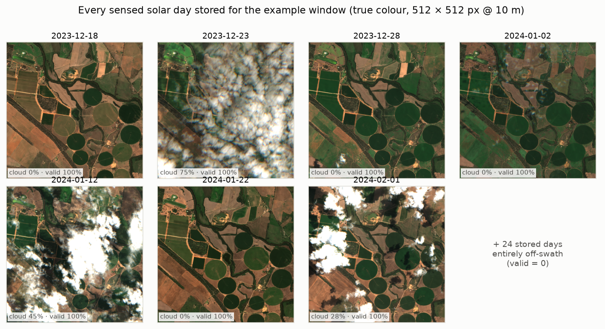
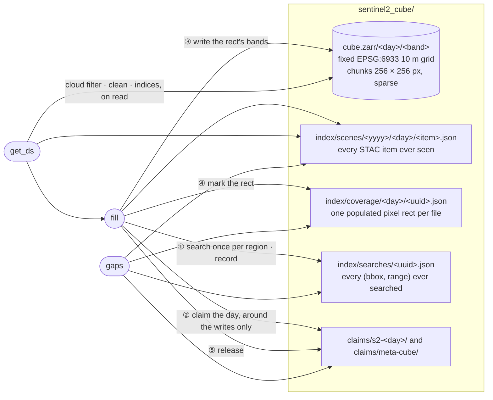
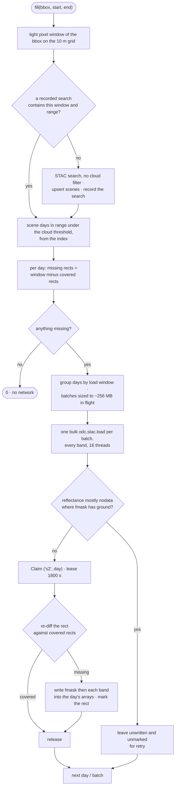

# pysentinel2

A **local Sentinel-2 datacube that fills itself on demand**. Every pixel
this machine ever downloads lands in one sparse, pixel-indexed store —
so nothing is ever downloaded twice: overlapping areas, extended date
ranges and repeat runs all reuse the same chunks. Part of the
[Borevitz Lab](https://biology.anu.edu.au/research/research-groups/borevitz-group-plant-genomics-climate-adaption) ecosystem; the default
source is [Digital Earth Australia](https://explorer.dea.ga.gov.au/)'s
ARD collections (`ga_s2am_ard_3` / `ga_s2bm_ard_3`) via STAC.

Full documentation — architecture, grid geometry, storage, cleaning,
indices, robustness — is in [`docs/`](docs/README.md), with flowcharts
and figures generated from a real store.


*Contents of the store for a 2 × 2 km example window. Clear, cloudy and
off-swath days are all stored raw and classified at read time.*

## How it works

```
{tmp_dir}/sentinel2_cube/
├── cube.zarr/
│   ├── 2024-01-03/   # one group per solar day
│   │   ├── nbart_red # arrays on a fixed EPSG:6933 10 m global grid
│   │   └── ...       # sparse: only written 256×256-px chunks exist on disk
│   └── 2024-01-08/ ...
├── index/
│   ├── coverage/2024-01-03/<uuid>.json   # one populated pixel rect per file
│   ├── scenes/2024/2024-01-03/<item>.json # every STAC item ever seen
│   └── searches/<uuid>.json              # every (bbox, range) ever searched
└── claims/       # cross-node mutex dirs, present only while a day is written
```

- Any bbox maps deterministically to a pixel window on the fixed grid.
  `Cube.get_ds(bbox, start, end)` subtracts each day's recorded coverage
  rectangles from that window and downloads **only the missing pixels** —
  coverage accounting is pixel-exact, so small farms pay no chunk padding
  (256×256-px chunks remain the *storage* unit inside the Zarr arrays).
- STAC results are cached (full item JSON) in the index, so re-reads and
  re-fills of known regions work without re-searching. Cloud-cover
  filtering happens at read time from the index — relaxing the threshold
  later needs no re-search.
- Only raw bands (incl. fmask) are stored. `get_ds(..., clean=True)` applies
  cloud masking **on read** — there is no second "clean" copy on disk,
  roughly halving storage versus a raw+clean layout. See
  [Cleaning & masking](#cleaning--masking) for exactly what the mask does.
- Spectral indices — NDVI, CFI, NIRv, NDTI, CAI — are on-read
  derivatives too: `get_ds(..., indices=('NDVI', 'NIRv'))` computes them
  from cloud-masked reflectance and stores nothing.
- The index is files, not a database. This branch (`gadi`) fills the
  cube from many PBS jobs on many Gadi nodes against one store on Lustre,
  where file locks are node-local and SQLite is unsafe; see
  [troi/docs/ledger.md](https://github.com/thestochasticman/troi/blob/gadi/docs/ledger.md).
  Every marker is committed by atomic rename after its pixels, so a
  crash mid-fill just leaves cells unmarked and the next run resumes.
  Rect writes are partial chunks, so each day is written under a claim
  directory; different days never contend.
- `cube.gaps(bbox, start, end)` lists each scene day whose tight window is
  not fully covered (`never_fetched` or `claimed_in_progress`), plus one
  unit if the region was never searched. No network. `get_ds` carries the
  lab's georeferencing attrs `crs`, `transform`, `nodata`, `native_res_m`.

### The pieces


```mermaid
flowchart LR
    subgraph root ["sentinel2_cube/"]
        direction TB
        Z[("cube.zarr/&lt;day&gt;/&lt;band&gt;<br/>fixed EPSG:6933 10 m grid<br/>chunks 256 × 256 px, sparse")]
        SC["index/scenes/&lt;yyyy&gt;/&lt;day&gt;/&lt;item&gt;.json<br/>every STAC item ever seen"]
        CV["index/coverage/&lt;day&gt;/&lt;uuid&gt;.json<br/>one populated pixel rect per file"]
        SR["index/searches/&lt;uuid&gt;.json<br/>every (bbox, range) ever searched"]
        C["claims/s2-&lt;day&gt;/ and claims/meta-cube/"]
    end
    FILL(["fill"]) -->|"① search once per region · record"| SR
    FILL --> SC
    FILL -->|"② claim the day, around the writes only"| C
    FILL -->|"③ write the rect's bands"| Z
    FILL -->|"④ mark the rect"| CV
    FILL -->|"⑤ release"| C
    GET(["get_ds"]) --> FILL
    GET -->|"cloud filter · clean · indices, on read"| Z
    GET --> SC
    GAPS(["gaps"]) --> SR
    GAPS --> SC
    GAPS --> CV
    GAPS --> C
```

The unit of the ledger is a **pixel rectangle of one solar day**: fills
only ever write axis-aligned windows, so a day's coverage is a short
list of rects and the missing work is the request window minus them,
pixel-exact. Rects are smaller than the 256 px chunks, so the chunks
touched by a day are read, updated and written back under that day's
claim. Download happens before the claim is taken, so the claim is held
for the writes only. Shared primitives and the general protocol are in
[troi/docs/ledger.md](https://github.com/thestochasticman/troi/blob/gadi/docs/ledger.md).

### A fill, step by step


```mermaid
flowchart TD
    R(["fill(bbox, start, end)"]) --> W["tight pixel window of the bbox on the 10 m grid"]
    W --> SR{"a recorded search<br/>contains this window and range?"}
    SR -- no --> ST["STAC search, no cloud filter ·<br/>upsert scenes · record the search"]
    SR -- yes --> DAYS
    ST --> DAYS["scene days in range under the cloud threshold,<br/>from the index"]
    DAYS --> MISS["per day: missing rects =<br/>window minus covered rects"]
    MISS --> D1{"anything missing?"}
    D1 -- no --> DONE(["0 · no network"])
    D1 -- yes --> GRP["group days by load window ·<br/>batches sized to ~256 MB in flight"]
    GRP --> LD["one bulk odc.stac.load per batch,<br/>every band, 16 threads"]
    LD --> GATE{"reflectance mostly nodata<br/>where fmask has ground?"}
    GATE -- yes --> FAIL["leave unwritten and unmarked<br/>for retry"]
    GATE -- no --> C["Claim ('s2', day) · lease 1800 s"]
    C --> D2{"re-diff the rect<br/>against covered rects"}
    D2 -- covered --> REL
    D2 -- missing --> WR["write fmask then each band<br/>into the day's arrays · mark the rect"]
    WR --> REL["release"] --> NXT["next day / batch"]
    FAIL --> NXT
```

### What `gaps()` can say

`gaps(bbox, start, end)` enumerates the scene days of the index for the
window and classifies every one whose coverage rects do not cover it.
It touches no network.

| status | for a unit |
|---|---|
| `never_fetched` with detail `region never searched` | the (window, range) has no recorded search, so the scene list is unknown; one extra unit, and the day count is a lower bound |
| `claimed_in_progress` | another job holds that day's claim right now |
| `never_fetched` | part of the window has no coverage rect for that day; this should be 0 after a fill |

A searched day with no scene is not a gap: the index knows there was
nothing to fetch.

## Usage

The core API is **troi-agnostic** — just a bbox and dates, no setup:

```python
from datetime import date
from pysentinel2.cube import Cube

cube = Cube()
bbox = [148.36265, -33.52606, 148.38265, -33.50606]  # [W, S, E, N]

ds_raw = cube.get_ds(bbox, date(2024, 1, 1), date(2024, 12, 31))
ds     = cube.get_ds(bbox, date(2024, 1, 1), date(2024, 12, 31), clean=True)
ds     = cube.get_ds(bbox, date(2024, 1, 1), date(2024, 12, 31),
                     indices=('NDVI', 'CFI', 'NIRv', 'NDTI', 'CAI'))

cube.fill(bbox, date(2024, 1, 1), date(2024, 12, 31))  # → 0: already local
```

Pipelines that speak the shared `troi.troi.Troi` (the
reproducibility layer — stubs, registry) use the adapters:

```python
ds = cube.get_ds_troi(troi)            # = cube.get_ds(troi.bbox, troi.start, troi.end)
```

`download_sentinel2(troi)` and `clean_sentinel2(troi)` remain as thin
wrappers over `Cube.get_ds_troi` for pipeline compatibility.

Package design (shared across the lab's packages — no inheritance,
composition only):

- **`Troi`** (from `troi`) — identity: what region, what dates.
- **`Sentinel2`** (`pysentinel2.sentinel2`) — config: STAC URL,
  collections, bands, CRS, cloud threshold, fmask codes.
- **`Paths`** (`pysentinel2.paths`) — derived locations of the store for
  a given `Config`.
- **`grid`** — the fixed global grid (pure, offline-testable math).
- **`Index`** (`pysentinel2.index`) — the file ledger of coverage rects,
  seen scenes and past searches.
- **`Cube`** (`pysentinel2.cube`) — ties them together.

## Cleaning & masking

`clean=True` (and any `indices=` request, which implies it) runs the
window through `pysentinel2.cube.clean_dataset`. The design principle:
**invalid and contaminated are different things.**

| Pixel state | fmask | Meaning | Treatment |
|---|---|---|---|
| Invalid | 0 (nodata) | Outside the scene footprint / never sensed | → NaN; counts *against coverage*, not against cloudiness |
| Clear | 1 | Usable land observation | kept |
| Cloud | 2 | Contaminated | → NaN (dilated) |
| Shadow | 3 | Contaminated | → NaN (dilated) |
| Snow | 4 | Surface state; corrupts vegetation statistics | → NaN by default (`mask_snow=False` to keep); never counts toward the frame gate |
| Water | 5 | Legitimate signal (NDWI, dams, rivers) | kept by default (`mask_water=True` to drop) |

Contaminated pixels are dilated before masking, frames are gated on the
two fractions independently, and every read is annotated with the
statistics and thresholds that produced it. Nothing is persisted —
different thresholds on the same window are just different reads of the
same raw store. Full pipeline, tunables and figures:
[docs/cleaning.md](docs/cleaning.md).

## Performance

Live measurements against DEA — a ~2 × 2 km AOI, 11-band ARD at 10 m
(one *cell* = one 256 × 256-px chunk on one solar day):

| Scenario | Downloaded | Time |
|---|---|---|
| Cold fill — 3 weeks (3 clear scenes) | 12 cells | 5.7 s |
| Same request again | nothing | **0.0 s** |
| AOI shifted 1 km (inside cached chunks) | nothing | **0.0 s** |
| Date range extended +1 month | 32 cells — *new days only* | 17.2 s |
| Read cached window (512² px × 3 days × 11 bands) | — | 0.13 s |
| Read cached window, cloud-masked (`clean=True`) | — | 0.23 s |

Store footprint: **13.6 MB for 11 solar days** — raw + fmask only, since
the clean cube is a 0.1 s on-read transform rather than a second copy.

Absolute times vary with network and DEA load. The zero rows are the
significant ones: those requests are resolved by index lookups alone,
with no network access.

Multi-year fills are batched, not per-day: all 11 bands for up to 64
missing days come down in one bulk load per batch (see
[the fill algorithm](docs/architecture.md#the-fill-algorithm)), keeping
the I/O threads saturated across day boundaries — a two-month cold fill
measured 20-26 s where a per-day loop measured 33 s on a healthy DEA
and 270 s on a degraded one, and the gap widens with the length of the
range. An earlier fmask-first screening pass was removed after
measurement: it skipped 8.8% of days' reflectance while paying an extra
request round on every day.

## Install

### pip

```bash
pip install git+https://github.com/thestochasticman/pysentinel2.git@gadi
```

Dependencies (the `troi` core included, pulled from GitHub) are
declared in `pyproject.toml` and installed automatically.

### From source

```bash
git clone https://github.com/thestochasticman/pysentinel2.git
cd pysentinel2
pip install -e .
```

The wheels for `rasterio`/`rioxarray`/`opencv` bundle their native
libraries on common platforms; in a conda environment the conda-forge
equivalents are used instead if already installed.

## Robustness notes

Hardening for DEA's public S3 + STAC quirks (cold-start 504s, stalled
reads, corrupt tiles) is built in — see
[docs/robustness.md](docs/robustness.md) and, for the underlying
investigations, [`diagnostics.md`](diagnostics.md).

## Test

```bash
# offline (pure math + synthetic store):
python pysentinel2/grid.py    # True
python pysentinel2/index.py   # True
python pysentinel2/paths.py   # True
python pysentinel2/cube.py    # True

# live (small real downloads from DEA, incl. dedup assertions):
python pysentinel2/download_sentinel2.py  # True
python pysentinel2/clean_sentinel2.py     # True
```
