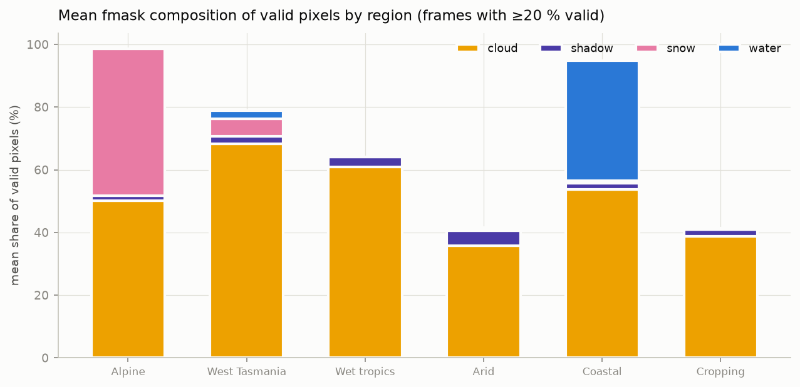
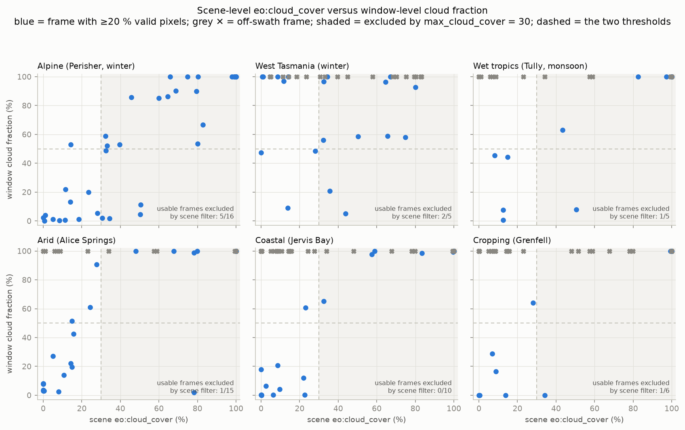
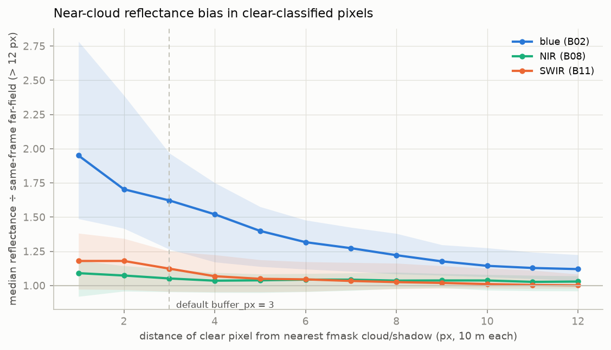
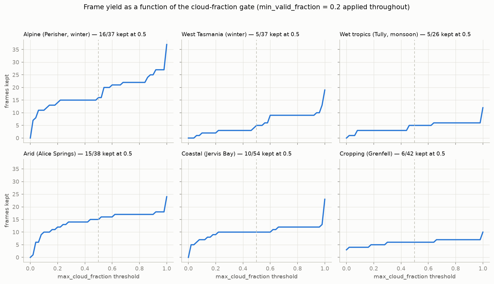

# Parameter-selection analysis: difficult regions

This directory contains a reproducible harness and the resulting
analysis used to evaluate the package's download and cleaning
parameters against regions chosen to stress different failure modes.
All data is real Sentinel-2 ARD downloaded from DEA with the
scene-level cloud filter disabled (`max_cloud_cover = 100`), so the
analysis observes every acquisition, including those the default
configuration would exclude.

| Region | Window (≈2 × 2 km) | Period | Stressor |
|---|---|---|---|
| `alpine_snow` | Perisher Valley, NSW | Jun–Aug 2023 | winter snow cover |
| `tas_west_cloud` | near Queenstown, TAS | Jun–Aug 2023 | persistent frontal cloud |
| `wet_tropics` | Tully, QLD | Jan–Feb 2024 | monsoonal convective cloud |
| `arid_control` | near Alice Springs, NT | Jan–Feb 2024 | near-permanent clear sky |
| `coastal_mixed` | Jervis Bay, NSW | Jan–Feb 2024 | open water, swath edges |
| `cropping_control` | Grenfell, NSW | Dec 2023–Feb 2024 | the documented example window |

234 frames were analysed (`data/frames.csv`); 406 near-cloud
reflectance profiles were extracted from partly cloudy frames
(`data/rings.csv`). To reproduce: `python analysis/harness.py` then
`python analysis/figures.py` (fills are incremental; re-runs read the
machine-wide cube).

## Finding 1 — the scene-level cloud filter discards usable frames

`Sentinel2.max_cloud_cover` (default 30) filters days by the STAC
`eo:cloud_cover` property, which describes the full ~100 × 100 km
granule. For the 2 km windows this package typically serves, granule
cloudiness is a weak predictor of window cloudiness (r = 0.76, n = 125
usable frames):

Across the six regions, the default threshold excludes **10 of the 57
frames (18 %) that pass the window-level quality gates** — worst in the
alpine region (5 of 16, 31 %), where scattered valley cloud inflates
granule statistics while the window itself is clear. The converse error
also occurs: 11 frames pass the scene filter but fail the window gates,
so their download is wasted.

| `max_cloud_cover` | usable frames kept | usable frames lost | unusable frames downloaded |
|---|---|---|---|
| 10 | 29 | 28 | 3 |
| 30 (default) | 47 | 10 | 11 |
| 50 | 53 | 4 | 21 |
| **80** | **57** | **0** | **37** |
| 100 | 57 | 0 | 68 |

**Recommendation.** For completeness-critical work, set
`Sentinel2(max_cloud_cover=80)`: in this survey it recovers every
usable frame at the cost of downloading roughly one wasted frame per
usable one — a bounded, one-time cost in a permanent cache. The
structurally better solution is an **fmask-first adaptive fill**:
download only the fmask band for every candidate day (it compresses
~55×, so it costs a small fraction of a full download), compute the
window-level cloud fraction, and fetch the remaining ten bands only for
days that pass the gates. This removes both error types at ~1/10 of the
wasted-download cost, at the price of a second load pass per day.

## Finding 2 — snow should not count toward the frame gate

`clean_dataset` currently adds snow (when `mask_snow=True`, the
default) to the same "contaminated" class as cloud and shadow, so the
snow fraction is included in `cloud_fraction` and counts toward the
`max_cloud_fraction` drop decision. In the alpine winter this conflation
is severe: of 37 usable frames, **16 are cloud-clear but exceed the
gate purely because of snow** (e.g. 2023-06-21: 100 % snow, 0 % cloud)
and are dropped outright.

Snow differs from cloud in kind: it is a stable, correctly classified
land-surface state, not a transient sensing failure. Masking snow
pixels for vegetation work is appropriate; discarding an entire clear
frame because the landscape is snow-covered is not — the same frame is
a valid observation for snow-cover, hydrology or albedo work with
`mask_snow=False`.

**Recommendation.** Decouple the two roles: compute `cloud_fraction`
from cloud and shadow only, continue masking snow pixels per
`mask_snow`, and attach the snow share as its own `snow_fraction` time
coordinate so downstream consumers can filter on it explicitly.

## Finding 3 — the default cloud buffer is too small

For partly cloudy frames, clear-classified pixels were binned by
distance to the nearest fmask cloud or shadow, and each band's median
reflectance was normalised by the same frame's far-field (> 12 px)
median:

The bias is large and decays slowly. With the default `buffer_px = 3`,
the first retained ring (4 px) still shows **+49 % median bias in red
and +52 % in blue**; visible-band bias remains above +10 % out to
~10 px. The near-infrared and shortwave-infrared bands are far less
affected (≤ +9 % at 1 px, ~+3–5 % plateau), so index formulas built on
NIR/SWIR degrade less than the visible-band numbers suggest. The cost
of widening the buffer, measured on the same frames, is the share of
clear pixels sacrificed:

| `buffer_px` | first retained ring bias (red) | clear pixels lost (median, partly cloudy frames) |
|---|---|---|
| 3 (default) | +49 % | 11 % |
| 5 | +25 % | 19 % |
| 6 | +21 % | 22 % |
| 8 | +12 % | 28 % |
| 10 | +8 % | 32 % |

**Recommendation.** Raise the default to `buffer_px = 5`, which halves
the edge bias for a further ~8 % pixel cost, and document `buffer_px =
8–10` for radiometrically demanding visible-band applications. Note the
measured bias is a lower bound: the far-field baseline of a partly
cloudy frame may itself carry residual contamination.

## Finding 4 — the remaining defaults are supported by the data

- **`max_cloud_fraction = 0.5`.** The yield curves are shallow around
  0.5 in every region — there is no sharp knee, and the value sits in a
  stable region of the trade-off. No change recommended.
  
- **`min_valid_fraction = 0.2`.** Off-swath and sliver frames separate
  cleanly from partial-but-usable frames in all regions, including
  coastal; the threshold's exact position is not sensitive.
- **`mask_water = False`.** The coastal window carries a median 8 %
  legitimate water; masking it by default would discard signal that
  NDWI-type work requires. Confirmed as the correct default.
- **Difficult regions are download-budget problems, not threshold
  problems.** West Tasmania in winter yields 5 usable frames from 37
  acquisitions and the wet tropics 5 from 26 at the default gates;
  relaxing gates would admit contaminated frames rather than recover
  clear ones. The effective lever in such regions is a longer date
  range (and Finding 1's scene-filter change, which recovers what
  exists).

## Summary of recommended changes

| Parameter | Current | Recommended | Basis |
|---|---|---|---|
| `Sentinel2.max_cloud_cover` | 30 | 80, or fmask-first adaptive fill | Finding 1 |
| `cloud_fraction` gate composition | cloud + shadow + snow | cloud + shadow only; separate `snow_fraction` coordinate | Finding 2 |
| `clean_dataset` `buffer_px` | 3 | 5 (8–10 for visible-band radiometry) | Finding 3 |
| `max_cloud_fraction` | 0.5 | unchanged | Finding 4 |
| `min_valid_fraction` | 0.2 | unchanged | Finding 4 |
| `mask_water` | False | unchanged | Finding 4 |
