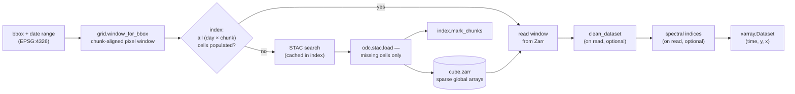

# pysentinel2 — documentation

`pysentinel2` maintains a **machine-wide Sentinel-2 datacube that fills
itself on demand**: every pixel the machine ever downloads lands in one
sparse, chunk-indexed Zarr store on a fixed equal-area grid, backed by a
SQLite ledger of what is populated and what has been searched. Repeat
queries, overlapping regions and extended date ranges re-download
nothing. Cloud masking and spectral indices are **on-read transforms** —
only raw Analysis-Ready Data (ARD) bands are ever persisted.

The default source is [Digital Earth Australia](https://knowledge.dea.ga.gov.au/)'s
Sentinel-2 ARD collections (`ga_s2am_ard_3` / `ga_s2bm_ard_3`), served
over STAC from public S3.

| Page | Contents |
|---|---|
| [Architecture](architecture.md) | Package composition, the `fill`/`get_ds` data flow, design principles |
| [The grid](grid.md) | The fixed EPSG:6933 grid, chunk geometry, and why it makes deduplication deterministic |
| [Storage & index](storage.md) | Zarr store layout, the SQLite schema, crash-safety semantics |
| [Cleaning & masking](cleaning.md) | The fmask-based on-read cleaning pipeline: classification, dilation, frame gating |
| [Spectral indices](indices.md) | On-read index derivation: NDVI, NIRv, NDTI, CAI, CFI — formulas and provenance |
| [Robustness](robustness.md) | Hardening against DEA STAC/S3 failure modes (see also [`diagnostics.md`](../diagnostics.md)) |

## The cube at a glance

A single call resolves a geographic query against the local store,
downloads only the missing (solar-day × chunk) cells, and returns an
[`xarray.Dataset`](https://docs.xarray.dev/) on the fixed grid:

```python
from datetime import date
from pysentinel2.cube import Cube

cube = Cube()
bbox = [148.36265, -33.52606, 148.38265, -33.50606]   # [W, S, E, N], EPSG:4326

ds_raw   = cube.get_ds(bbox, date(2023, 12, 15), date(2024, 2, 5))
ds_clean = cube.get_ds(bbox, date(2023, 12, 15), date(2024, 2, 5), clean=True)
ds_ndvi  = cube.get_ds(bbox, date(2023, 12, 15), date(2024, 2, 5), indices=('NDVI',))
```

The figure below shows every solar day the store holds for that window —
an irrigated cropping area near Grenfell, New South Wales. Empty panels
are days on which the Sentinel-2 swath missed the window entirely
(stored as nodata, and distinguished from cloud by the
[cleaning pipeline](cleaning.md)); cloudy and partly cloudy days are
stored raw and masked on read.


## Data flow



## Design principles

1. **One store per machine, keyed by grid position — not by query.**
   Two studies over overlapping paddocks share pixels transparently.
2. **The unit of work is the (solar-day × chunk) cell.** Downloads,
   ledger entries and deduplication all operate on whole 256 × 256-pixel
   chunks, so a cell recorded as done is bit-complete on disk.
3. **Derived products are views, not copies.** Cloud masking and
   spectral indices are cheap array transforms; persisting them would
   double storage and freeze one choice of thresholds. Different
   thresholds are simply different reads of the same raw store.
4. **Composition, no inheritance.** `Cube` is assembled from independent,
   individually testable parts (`grid`, `Index`, `Paths`, `Sentinel2`) —
   a convention shared across the Borevitz Lab packages.
5. **Crash tolerance by construction.** Writes are whole-chunk and the
   ledger is transactional (SQLite/WAL); an interrupted fill leaves
   cells unmarked, and the next run resumes exactly there.

## Reproducing the figures

All figures in these pages are generated by
[`docs/make_figures.py`](make_figures.py) from a real store over the
example window (148.363–148.383 °E, 33.506–33.526 °S, 2023-12-15 →
2024-02-05) using only public DEA data:

```bash
conda activate borevitz_lab
python docs/make_figures.py     # first run downloads once; later runs are cache-only
```
