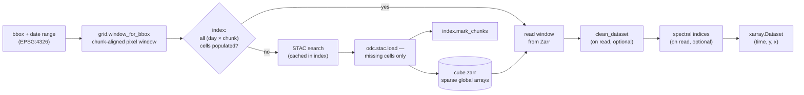

# pysentinel2 — documentation

Reference documentation for the self-filling Sentinel-2 datacube — what
it is and how to use it is the [main README](../README.md); these pages
cover how and why it works.

| Page | Contents |
|---|---|
| [Architecture](architecture.md) | Package composition, the `fill`/`get_ds` data flow, design principles |
| [The grid](grid.md) | The fixed EPSG:6933 grid, chunk geometry, and why it makes deduplication deterministic |
| [Storage & index](storage.md) | Zarr store layout, the SQLite schema, crash-safety semantics |
| [Cleaning & masking](cleaning.md) | The fmask-based on-read cleaning pipeline: classification, dilation, frame gating |
| [Spectral indices](indices.md) | On-read index derivation: NDVI, NIRv, NDTI, CAI, CFI — formulas and provenance |
| [Robustness](robustness.md) | Hardening against DEA STAC/S3 failure modes (see also [`diagnostics.md`](../diagnostics.md)) |
| [Parameter analysis](../analysis/README.md) | Difficult-region survey (snow, persistent cloud, coast) behind the download and cleaning defaults |

All figures are generated from a real store over one example window —
an irrigated cropping area near Grenfell, New South Wales
(148.363–148.383 °E, 33.506–33.526 °S, 2023-12-15 → 2024-02-05); see
[Reproducing the figures](#reproducing-the-figures).

## Data flow

One call — `Cube.get_ds(bbox, start, end)` — resolves a geographic query
against the local store, downloads only the missing (solar-day × chunk)
cells, and returns an [`xarray.Dataset`](https://docs.xarray.dev/) on
the fixed grid:



## Design principles

1. **One store per machine, keyed by grid position rather than by
   query.** Two studies over overlapping areas share pixels
   transparently.
2. **The unit of work is the (solar-day × chunk) cell.** Downloads,
   ledger entries and deduplication all operate on whole
   256 × 256-pixel chunks, so a cell recorded as done is complete on
   disk.
3. **Derived products are views, not copies.** Cloud masking and
   spectral indices are inexpensive array transforms; persisting them
   would double storage and fix one choice of thresholds. Different
   thresholds are simply different reads of the same raw store.
4. **Composition rather than inheritance.** `Cube` is assembled from
   independent, individually testable parts (`grid`, `Index`, `Paths`,
   `Sentinel2`), a convention shared across the Borevitz Lab packages.
5. **Crash tolerance by construction.** Writes are whole-chunk and the
   ledger is transactional (SQLite/WAL); an interrupted fill leaves
   cells unmarked, and the next run resumes from that point.

## Reproducing the figures

All figures in these pages are generated by
[`docs/make_figures.py`](make_figures.py) using only public DEA data:

```bash
conda activate borevitz_lab
python docs/make_figures.py     # first run downloads once; later runs are cache-only
```
