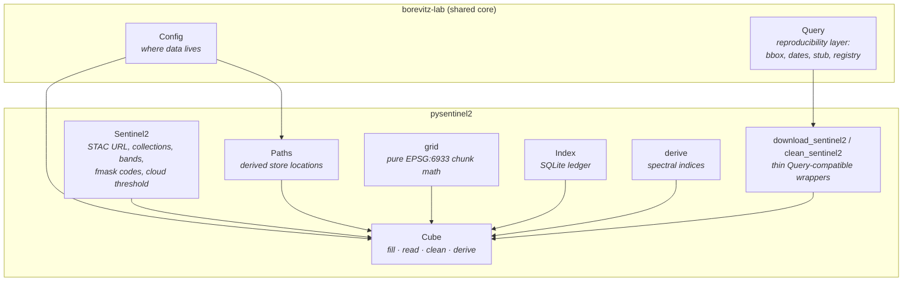
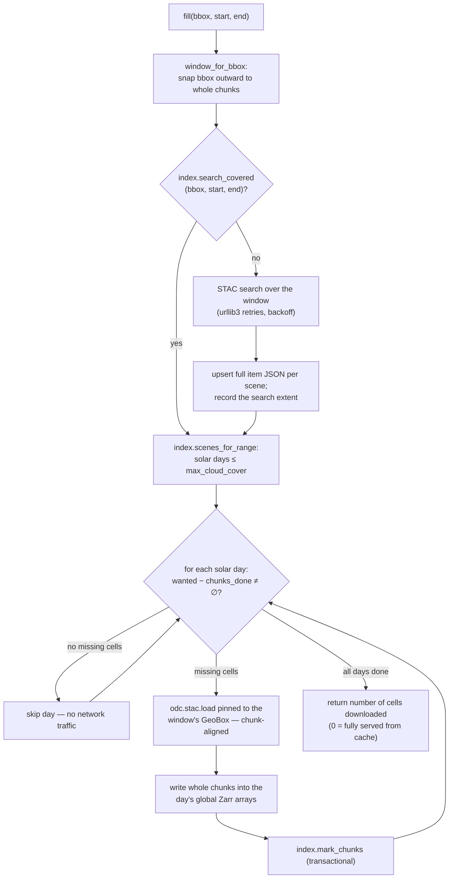

# Architecture

## Package composition

The package follows the lab-wide convention of **composition over
inheritance**: each concern lives in one module with a narrow interface,
and `Cube` assembles them. Every module carries its own offline test
suite (`python pysentinel2/<module>.py` → `True`).

| Component | Module | Responsibility |
|---|---|---|
| `Sentinel2` | `pysentinel2/sentinel2.py` | Immutable configuration: STAC endpoint, the two DEA ARD collections, the 11 stored bands, fmask class codes, per-scene cloud-cover threshold. |
| `Paths` | `pysentinel2/paths.py` | Derives the store locations (`{tmp_dir}/sentinel2_cube/{cube.zarr, index.db}`) from a `Config`. Inputs go in `Config`; derived locations in `Paths`. |
| `grid` | `pysentinel2/grid.py` | The fixed global grid. Pure functions, no I/O — see [The grid](grid.md). |
| `Index` | `pysentinel2/index.py` | The SQLite ledger of populated cells, seen scenes, and past searches — see [Storage & index](storage.md). |
| `Cube` | `pysentinel2/cube.py` | Orchestration: diff → fill → read → (optionally) clean → (optionally) derive. |
| `derive` | `pysentinel2/derive.py` | On-read spectral indices — see [Spectral indices](indices.md). |
| wrappers | `download_sentinel2.py`, `clean_sentinel2.py` | Compatibility entry points for pipelines that speak `borevitz_lab.query.Query`. |

The core API is deliberately query-agnostic — `Cube.get_ds(bbox,
start, end)` needs nothing but a region and a date range. The `Query`
adapters (`get_ds_query`, `fill_query`) exist so pipelines built on the
lab's reproducibility layer plug in without translation code.

## The `fill` algorithm

`fill()` is the write path; `get_ds()` is `fill()` followed by a read.
The unit of accounting throughout is the (solar-day × chunk) cell.

Two properties underpin the correctness of the scheme:

- **Downloads are pinned to the grid.** `odc.stac.load` receives a
  `GeoBox` constructed from the chunk-aligned window
  (`grid.geobox_for_window`), so every downloaded pixel lands at its
  single canonical position in the global array. Writes therefore
  cover whole chunks only, and a ledger row is accurate from the
  moment its transaction commits.
- **Search caching is separate from pixel caching.** The `searches`
  table distinguishes a region and range that was queried and returned
  no scenes from one that was never queried; without it, empty regions
  would be re-searched on every request. Scene records store the full
  STAC item JSON, so re-fills and cloud-threshold changes do not
  contact the STAC API again.

## The read path

Reads never touch the network beyond what `fill()` requires:

1. `scenes_for_range` selects solar days from the index, applying the
   per-scene `eo:cloud_cover ≤ max_cloud_cover` filter **at read time**.
   Relaxing the threshold later requires no re-search — newly eligible
   days simply become visible (and are filled on the next request).
2. Each day's bands are sliced from the day's global Zarr arrays at the
   window's pixel coordinates — an index lookup plus a few chunk reads.
3. `clean=True` applies the [cleaning pipeline](cleaning.md);
   `indices=(...)` additionally computes [spectral indices](indices.md).
   Both are pure array transforms on the returned window.

On a warm store, reading a 512 × 512-pixel × 11-band window across
several days takes on the order of 0.1–0.3 s (see the
[performance table](../README.md#performance) in the main README).

## Concurrency model

Downloads run under Dask's in-process threaded scheduler
(`scheduler='threads'`) rather than a distributed cluster. The choice
is deliberate: the workload is network-bound (S3 range reads), threads
share the GDAL/CURL configuration set in the main process, and the
distributed client exhibited a startup race in which workers opened
assets before receiving the unsigned-S3 configuration (see
[Robustness](robustness.md)).
