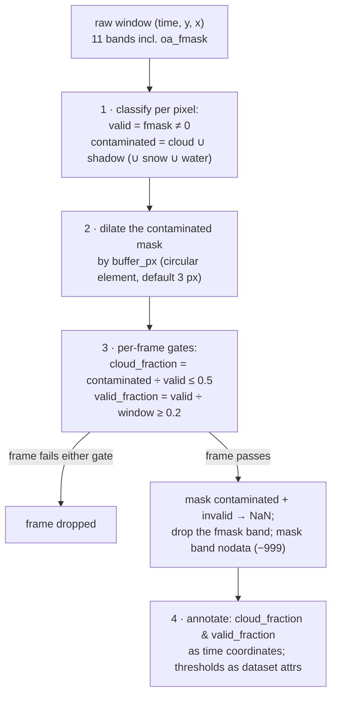
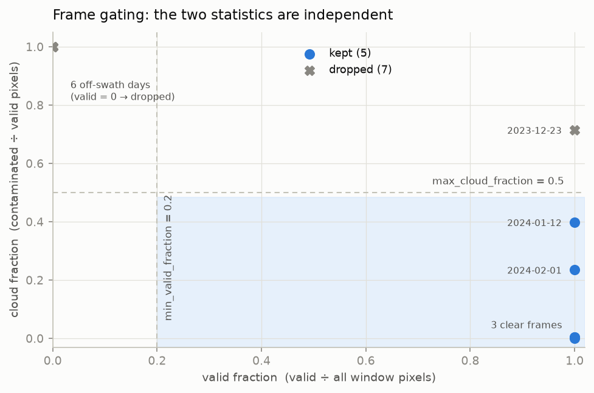

# Cleaning & masking

`get_ds(..., clean=True)` — and any `indices=` request, which implies
it — runs the window through `pysentinel2.cube.clean_dataset`. Nothing
here is persisted: the clean cube is a **view of the raw store**, so
different thresholds on the same window are just different reads, and
storage cost is roughly half of a raw + clean layout.

The masking source is DEA's `oa_fmask` band — a per-pixel classification
produced by the Fmask algorithm (Zhu & Woodcock, 2012; Frantz et al.,
2018, as implemented in DEA's ARD pipeline).

## The central distinction: invalid ≠ contaminated

A pixel can be unusable for two very different reasons, and conflating
them biases frame selection:

| State | fmask | Physical meaning | Treatment |
|---|---|---|---|
| Invalid | 0 (nodata) | Outside the swath / never sensed | → NaN; counts against **coverage**, not cloudiness |
| Clear | 1 | Usable land observation | kept |
| Cloud | 2 | Contaminated radiometry | → NaN (dilated) |
| Cloud shadow | 3 | Contaminated radiometry | → NaN (dilated) |
| Snow | 4 | Corrupts reflectance statistics like cloud | → NaN by default (`mask_snow=False` to keep) |
| Water | 5 | Legitimate surface signal (dams, rivers, NDWI) | kept by default (`mask_water=True` to drop) |

A frame whose window is 60 % off-swath but cloud-free under the
remaining 40 % is a *perfectly good observation of 40 % of the window*.
A rule that scores frames by total NaN fraction — as this package's
earlier implementation did — throws such frames away and systematically
biases against swath-edge regions.

## Pipeline



**Step 2 — dilation.** Fmask draws tight cloud boundaries. The bright
halo and penumbra immediately outside a detected cloud are the classic
source of "clear" pixels with corrupted reflectance (Zhu & Woodcock,
2012 recommend buffering for exactly this reason). The contaminated
mask is therefore dilated with a circular structuring element of radius
`buffer_px` (default 3 px ≈ 30 m) before masking. Dilation never
converts invalid pixels to contaminated — the mask is intersected with
the valid mask afterwards, so swath margins stay classified as
*invalid*, not *cloudy*.

**Step 3 — two independent gates.** For each frame:

$$
\mathrm{cloud\_fraction} = \frac{\#\,\text{contaminated}}{\#\,\text{valid}}
\qquad
\mathrm{valid\_fraction} = \frac{\#\,\text{valid}}{\#\,\text{window pixels}}
$$

A frame is kept iff
$\mathrm{cloud\_fraction} \le$ `max_cloud_fraction` (default 0.5) **and**
$\mathrm{valid\_fraction} \ge$ `min_valid_fraction` (default 0.2).
Because the cloudiness denominator is *valid* pixels, partial-swath
frames are not penalised for their margin; because coverage is gated
separately, a clear sliver of swath is still rejected as an unusable
observation.

## The pipeline on a real frame

The 2023-12-23 overpass of the example window is 72 % cloud-contaminated
over its valid pixels:


Panel **b** is the raw fmask classification; panel **c** overlays the
contaminated mask after dilation (the thin halo ring is the buffer);
panel **d** is what a consumer of `clean=True` would receive *if the
frame passed the gates* — at the default `max_cloud_fraction = 0.5`
this frame is dropped entirely.

## Frame gating on the example window

Across the 12 stored solar days, the two statistics separate three
regimes cleanly: fully valid clear/partly-cloudy frames (kept), one
heavily clouded frame (dropped by the cloud gate), and six days on
which the swath missed the window (dropped by the valid gate — *not*
recorded as "100 % cloudy" days):



## Auditability

Every survival decision is reconstructible from the returned dataset —
no logs needed:

```python
ds = cube.get_ds(bbox, start, end, clean=True)

ds.cloud_fraction          # (time,) — contamination of each surviving frame
ds.valid_fraction          # (time,) — coverage of each surviving frame
ds.attrs['max_cloud_fraction']    # the gates this read was made with
ds.attrs['min_valid_fraction']
ds.attrs['cloud_buffer_px']
ds.attrs['masked_fmask_classes']  # e.g. [2, 3, 4]
```

All parameters are per-read:

```python
ds = cube.get_ds(bbox, start, end, clean=True,
                 max_cloud_fraction=0.3,  # stricter contamination gate
                 min_valid_fraction=0.5,  # require ≥ half the window sensed
                 mask_water=True,         # pure-vegetation statistics
                 buffer_px=5)             # wider halo exclusion
```

## References

- Zhu, Z. & Woodcock, C. E. (2012). Object-based cloud and cloud shadow
  detection in Landsat imagery. *Remote Sensing of Environment*, 118,
  83–94.
- Frantz, D. et al. (2018). Improvement of the Fmask algorithm for
  Sentinel-2 images. *Remote Sensing of Environment*, 215, 471–481.
- Digital Earth Australia, *Sentinel-2 ARD* product documentation
  (`oa_fmask` observation attribute).
