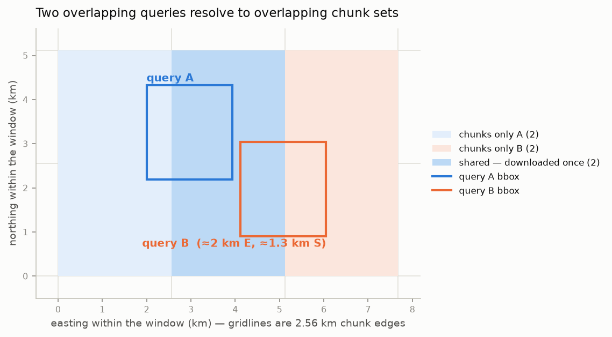

# The grid

Everything in the cube lives on **one fixed global grid, defined once**
(`pysentinel2/grid.py`). This is the property that makes deduplication
deterministic: any EPSG:4326 bounding box maps to exactly one set of
chunk identifiers, so two overlapping queries *necessarily* resolve to
overlapping chunk sets, and a chunk is only ever downloaded once.

## Specification

| Parameter | Value | Notes |
|---|---|---|
| CRS | EPSG:6933 | Equal-area cylindrical (EASE-Grid 2.0 Global) |
| Pixel size | 10 m × 10 m | Native resolution of the Sentinel-2 visible/NIR bands |
| Chunk size | 256 × 256 px (2.56 km × 2.56 km) | The unit of download, storage and deduplication |
| Origin (top-left) | x₀ = −17 369 600 m, y₀ = +7 326 720 m | Chunk-aligned; covers the full EPSG:6933 valid extent |
| Global extent | 3 473 920 × 1 465 344 px | Never materialised — only written chunks exist on disk |

EPSG:6933 is cylindrical: easting depends only on longitude and northing
only on latitude, both monotonically. Projecting the two corners of a
geographic bounding box is therefore **exact** — no densification of the
box edges is needed, which keeps the bbox → window mapping a closed-form
computation.

An equal-area CRS also means every pixel represents the same 100 m² of
ground everywhere on the globe, so per-frame statistics (valid fraction,
cloud fraction, spatial medians) are area-true without weighting.

## From bounding box to chunks

For a bbox projected to EPSG:6933 as $(x_0, y_0, x_1, y_1)$, with chunk
edge $c = 2560\ \text{m}$ and pixel size $r = 10\ \text{m}$:

$$
\mathrm{col}_0 = \left\lfloor \frac{x_0 - X_0}{c} \right\rfloor \cdot 256,
\qquad
\mathrm{col}_1 = \left\lceil \frac{x_1 - X_0}{c} \right\rceil \cdot 256
$$

$$
\mathrm{row}_0 = \left\lfloor \frac{Y_{top} - y_1}{c} \right\rfloor \cdot 256,
\qquad
\mathrm{row}_1 = \left\lceil \frac{Y_{top} - y_0}{c} \right\rceil \cdot 256
$$

The half-open pixel window $[\mathrm{row}_0, \mathrm{row}_1) \times
[\mathrm{col}_0, \mathrm{col}_1)$ is **snapped outward to whole
chunks** — it always contains the requested bbox and always consists of
complete chunks. A chunk is identified by $(c_y, c_x) =
(\mathrm{row}/256, \mathrm{col}/256)$.

Because the window is chunk-aligned:

- every write covers complete chunks, so the index ledger can record a
  cell as *done* without partial-write ambiguity;
- the requested window is the same set of bytes no matter which query
  produced it.

## Deduplication in practice

The figure below shows two queries over the example area. Query B is
displaced roughly 2 km east and 1.3 km south of query A. Both snap
outward to 2 × 2-chunk windows; two chunks coincide. When B runs after
A, only B's two new chunks are fetched — the shared chunks are served
from the store.

This is the mechanism behind the zero-cost rows of the
[performance table](../README.md#performance): a repeat request, or a
request shifted within already-covered chunks, is answered entirely from
the index and the local store.

## Pinning downloads to the grid

`grid.geobox_for_window` constructs an `odc.geo.geobox.GeoBox` with the
affine transform

$$
\begin{pmatrix} x \\ y \end{pmatrix} =
\begin{pmatrix} r & 0 \\ 0 & -r \end{pmatrix}
\begin{pmatrix} \mathrm{col} \\ \mathrm{row} \end{pmatrix} +
\begin{pmatrix} X_0 + \mathrm{col}_0\, r \\ Y_{top} - \mathrm{row}_0\, r \end{pmatrix}
$$

and passes it to `odc.stac.load`, which reprojects each source asset
(UTM-zoned Sentinel-2 tiles) onto exactly this window. Downloaded pixels
therefore land at their single canonical grid position — the same
ground cell requested twice yields byte-identical array slices.
