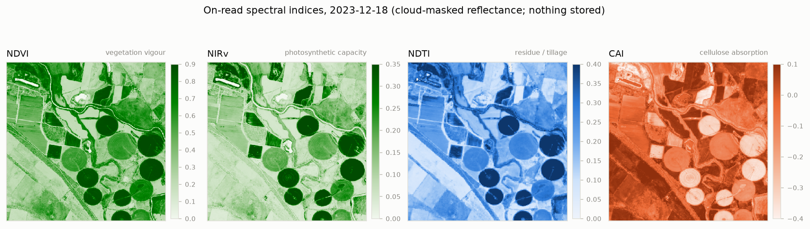
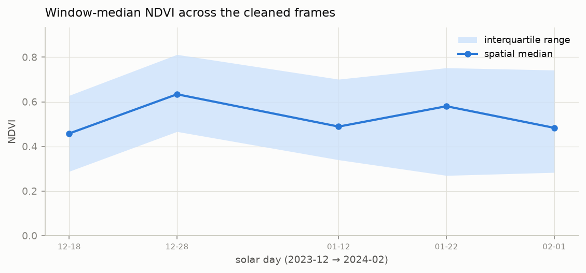

# Spectral indices

Indices are on-read derivatives (`pysentinel2/derive.py`): requested
per call, computed from cloud-masked reflectance, and never stored —
the same design as [cleaning](cleaning.md). Requesting any index
implies `clean=True`, so the formulas operate only on valid,
uncontaminated pixels.

```python
ds = cube.get_ds(bbox, start, end, indices=('NDVI', 'NIRv', 'NDTI', 'CAI'))
ds['NDVI']    # float32 (time, y, x), NaN where masked
```

Digital numbers are scaled to reflectance ($\rho = \mathrm{DN} / 10^4$);
DN 0 and the band nodata value (−999) are treated as missing before any
arithmetic, so indices are NaN wherever their inputs are.

## Definitions

With $\rho_{red}, \rho_{green}, \rho_{blue}$ the visible bands,
$\rho_{nir}$ = `nbart_nir_1` (B08, 832 nm), and $\rho_{swir2},
\rho_{swir3}$ = `nbart_swir_2` / `nbart_swir_3` (B11, 1610 nm / B12,
2190 nm):

| Index | Formula | Interpretation | Reference |
|---|---|---|---|
| NDVI | $\dfrac{\rho_{nir} - \rho_{red}}{\rho_{nir} + \rho_{red}}$ | Green-vegetation vigour / fractional cover | Rouse et al. (1974) |
| NIRv | $\mathrm{NDVI} \cdot \rho_{nir}$ | Proxy for photosynthetic capacity (GPP); suppresses soil-background sensitivity of NDVI | Badgley et al. (2017) |
| NDTI | $\dfrac{\rho_{swir2} - \rho_{swir3}}{\rho_{swir2} + \rho_{swir3}}$ | Crop-residue / tillage signal | Van Deventer et al. (1997) |
| CAI | $0.5\,(\rho_{swir2} + \rho_{swir3}) - \rho_{nir}$ | Cellulose/lignin absorption contrast | after Nagler et al. (2000)¹ |
| CFI | $\mathrm{NDVI} \cdot (\rho_{red} + 2\rho_{green} - \rho_{blue})$ | Crop-foliage contrast used in the lab's paddock time-series work | lab-internal |

¹ The original CAI is defined on narrow hyperspectral bands at 2.0, 2.1
and 2.2 µm. Sentinel-2 lacks a 2.0 µm band, so this is a broadband
approximation substituting B11/B12 and NIR — comparable across scenes
within this cube, but not numerically equivalent to hyperspectral CAI.

Normalised differences are computed with divide-by-zero suppressed and
non-finite results set to NaN.

## Example output

A clear mid-season frame (2024-01-22) over the example window —
centre-pivot irrigation circles read high in NDVI/NIRv and low in CAI,
while dry paddocks show the opposite contrast; NDTI highlights residue
cover on harvested fields:



Aggregating the same on-read NDVI over each surviving cleaned frame
gives a season trajectory without any intermediate product ever touching
disk:



## Adding an index

`derive.INDICES` maps names to functions of the (cleaned) dataset;
`add_indices` validates names and attaches results as `(time, y, x)`
variables. Adding a new index is one function plus one dictionary
entry — and a known-value test in the same file
(`python pysentinel2/derive.py` → `True`):

```python
def ndwi(ds: Dataset) -> np.ndarray:
    """Normalised Difference Water Index (McFeeters, 1996)."""
    return _normalised_diff(_band(ds, 'nbart_green'), _band(ds, 'nbart_nir_1'))

INDICES['NDWI'] = ndwi
```

## References

- Rouse, J. W. et al. (1974). Monitoring vegetation systems in the
  Great Plains with ERTS. *Third ERTS-1 Symposium*, NASA SP-351.
- Badgley, G., Field, C. B., & Berry, J. A. (2017). Canopy near-infrared
  reflectance and terrestrial photosynthesis. *Science Advances*, 3(3).
- Van Deventer, A. P. et al. (1997). Using Thematic Mapper data to
  identify contrasting soil plains and tillage practices.
  *Photogrammetric Engineering & Remote Sensing*, 63(1), 87–93.
- Nagler, P. L. et al. (2000). Plant litter and soil reflectance.
  *Remote Sensing of Environment*, 71(2), 207–215.
