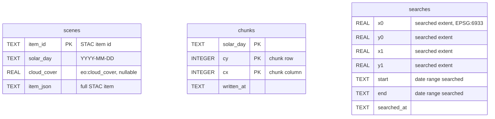
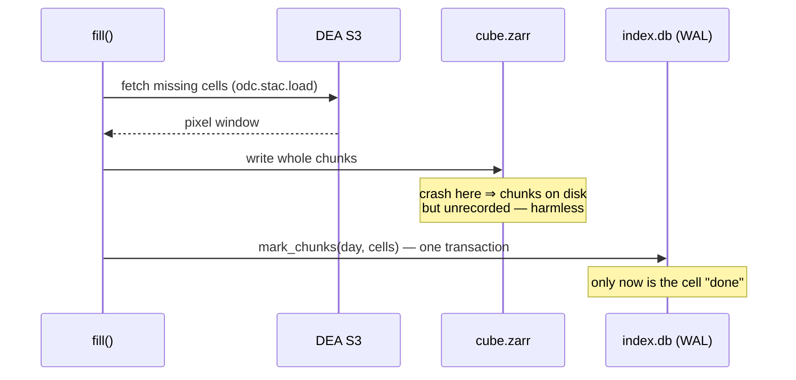

# Storage & index

The store has two halves under one directory: a **sparse Zarr store**
holding pixels and a **SQLite database** recording what those pixels
are and how they got there.

```
{config.tmp_dir}/sentinel2_cube/
├── index.db          # the ledger (SQLite, WAL mode)
└── cube.zarr/
    ├── 2023-12-18/   # one group per solar day
    │   ├── nbart_red         # one array per band on the full global grid
    │   ├── nbart_green
    │   ├── ...
    │   └── oa_fmask
    └── 2024-01-22/ ...
```

## The Zarr store

Each solar-day group holds one array per band, **logically global**
(3 473 920 × 1 465 344 px on the [fixed grid](grid.md)) but **physically
sparse**: Zarr materialises only chunks that have been written. A band
array chunked at 256 × 256 px means the on-disk chunk is exactly the
grid's dedup unit.

- Reflectance bands are `int16` with nodata −999 (DEA ARD convention);
  `oa_fmask` is `uint8` with nodata 0. The nodata value is recorded as
  an array attribute and doubles as the Zarr fill value, so *reading an
  unwritten region yields nodata* — indistinguishable from a region the
  satellite never sensed, which is exactly the semantics the
  [cleaning pipeline](cleaning.md) assigns it.
- Grouping by **solar day** (the UTC acquisition time shifted by the
  scene-centre longitude in degrees, $t_{solar} = t_{UTC} + \lambda / 15$ hours)
  merges the two Sentinel-2 satellites and adjacent swath tiles into one
  temporal layer per overpass day.
- Storage cost scales with *observed area × observed days*, not with
  the global grid: the example window (4 chunks × 12 days × 11 bands)
  occupies ≈ 14 MB.

## The SQLite ledger

Three tables, no pixels (`pysentinel2/index.py`):



**`scenes`** caches every STAC item ever returned, including its full
JSON. Day selection, cloud filtering and re-fills therefore work
offline; the STAC API is only contacted for regions/ranges never seen
before. Because *all* scenes are recorded regardless of cloud cover,
changing `max_cloud_cover` later is a pure read-side change.

**`chunks`** is the deduplication ledger: a row `(solar_day, cy, cx)`
asserts that this cell of the global grid is completely written for
that day. `fill()` computes `wanted − done` per day and downloads only
the difference.

**`searches`** records the spatial extent and date range of every STAC
search. `search_covered()` answers "is this request contained in some
past search?" — which is what distinguishes *"searched, no scenes
exist"* (a valid, cacheable answer) from *"never asked"*.

## Crash-safety semantics

The ordering of operations makes interrupted fills harmless:



- Pixels are written **before** the ledger row; the ledger commit is a
  single WAL transaction. A crash at any point leaves cells unmarked —
  the next run re-downloads and overwrites them idempotently (writes
  are whole-chunk at fixed positions, so overwriting is bit-identical
  convergence, not corruption).
- The inverse failure (ledger row without pixels) cannot occur, because
  `mark_chunks` runs only after the Zarr writes return.
- WAL mode allows concurrent readers while a fill is in progress.

## Where the store lives

Locations derive from the shared lab `Config`
(`pysentinel2/paths.py`): the store is **per data root, not per
query** — every query on the machine reads and fills the same cube.

```python
from pysentinel2.paths import Paths
paths = Paths()          # from the default Config
paths.store              # .../sentinel2_cube/cube.zarr
paths.index_db           # .../sentinel2_cube/index.db
```

Deleting the `sentinel2_cube/` directory is always safe — it is a
cache; the next query rebuilds exactly what it needs.
